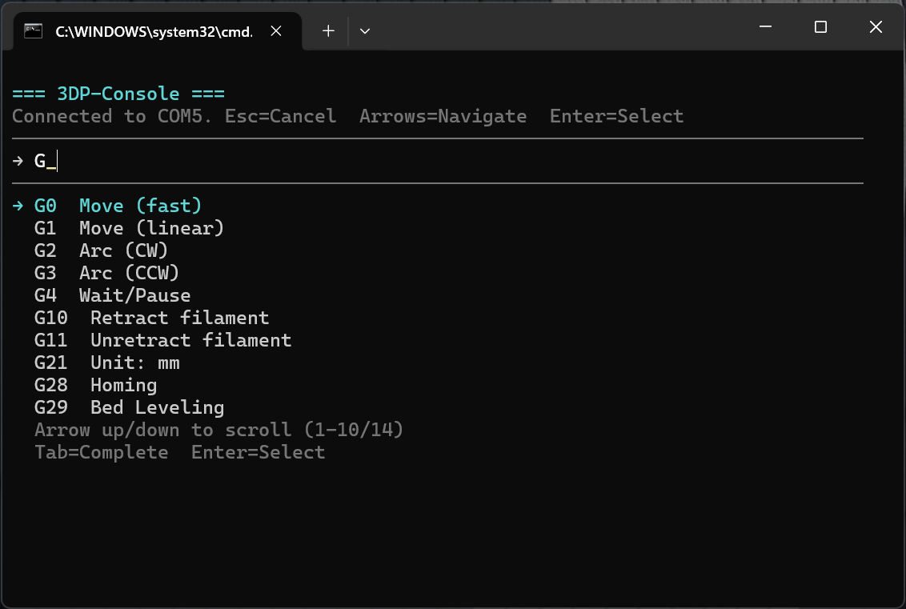
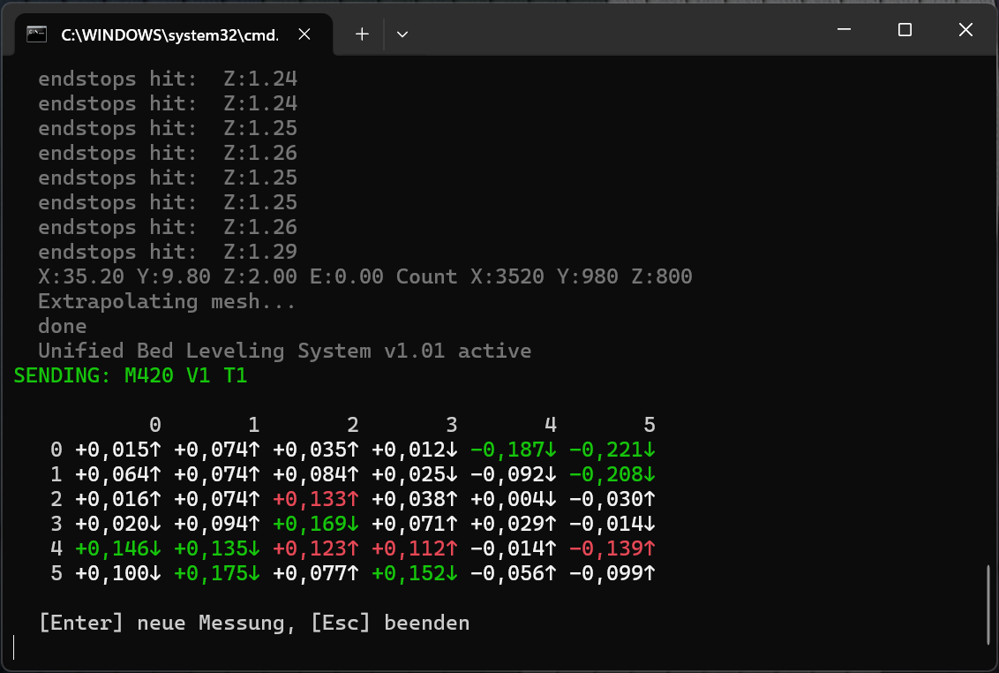
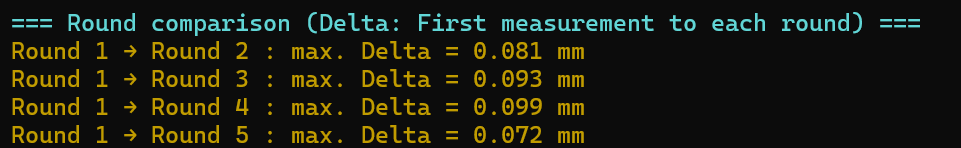

# 3DP-Console

[English](../README.md)

**Eine persönliche Anmerkung:** Dies ist mein erstes öffentliches Repository. Das Tool ist aus der Notwendigkeit entstanden: Ich hatte einen problematischen Prusa Mini Drucker, den ich debuggen und neu ausrichten musste. Manuelles G-Code-Testen war zu langsam, und bestehende Tools passten nicht zu meinem Workflow. Also habe ich dieses Tool entwickelt – und es hat mir geholfen herauszufinden, dass mein Sensor defekt war. Ich teile es, falls es anderen in ähnlichen Situationen hilft.

---

## Was ist das?

3DP-Console ist ein Tool zum Steuern und Testen von G-Code-basierten 3D-Druckern von einem Windows-PC aus. Es ist für einfache, schnelle und automatisierte Tests gedacht – ohne komplexe oder umfangreiche Software.

## Motivation

Ich musste einen Prusa Mini Drucker debuggen und neu ausrichten. Dabei habe ich viele manuelle Tests durchgeführt – Sensorverhalten, Bettausrichtung, Temperaturtests. Das manuelle Ausführen von G-Code-Befehlen war zu langsam und ineffizient. Bestehende Tools haben mir nicht gefallen oder waren für meinen Anwendungsfall ungeeignet, weshalb ich ein eigenes Tool entwickelt habe.

Mit diesem Tool konnte ich automatisierte Tests durchführen, Sensorreaktionen analysieren, das Druckbett mehrfach vermessen und das Verhalten des Druckers systematisch untersuchen. Am Ende stellte sich heraus, dass der Sensor defekt war – was ohne diese automatisierten Tests deutlich länger gedauert hätte.

## Funktionen

### Interaktives Terminal mit Suchmaschinen-ähnlicher Autovervollständigung

Tippe **`/`** (Slash-Befehle), **`G`** oder **`M`**, um die Paletten zu öffnen – ähnlich Autovervollständigung. Die Einträge sind in [`src/3DP-Config.ps1`](../src/3DP-Config.ps1) vollständig konfigurierbar (nur die von dir definierten Befehle erscheinen).



*Beispiel: Paletten-Navigation und Verbindungsstatus im Terminal.*

### Loops

Erstelle automatisierte Abläufe, die bestimmte Tests wiederholt ausführen. Nützlich für Temperaturtests, Sensoranalysen oder wiederholte Messungen des Druckbetts. Nutze vorbereitete Loops oder definiere eigene.



*Interaktives Bett-Leveling: Mesh-Zellen mit Ampelfarben (grün / gelb / rot).*



*Level-Compare: wiederholte Vermessung und Vergleich der Meshtabelle (Ausschnitt).*

### Makros

Fasse mehrere Befehle zu einem Ablauf zusammen. Vereinfacht wiederkehrende Prozesse wie Kalibrierungen oder Diagnosen.

### Stark konfigurierbar

Konfiguriere COM-Port, Baudrate, Makros, Loops, Befehle, Wartezeiten für Druckerantworten sowie Materialparameter (z.B. PLA-Temperaturen). Die wichtigsten Keys sind in der Tabelle unten; die Referenz bleibt die Datei [`src/3DP-Config.ps1`](../src/3DP-Config.ps1) (kommentierte Abschnitte).

## Konfigurationsreferenz (`3DP-Config.ps1`)

| Gruppe | Keys (Kurz) |
|--------|-------------|
| **Seriell** | `ComPort`, `BaudRate` (haeufig 115200; manche Boards 250000 — Abschnitt *Anderer Drucker, COM und Baudrate* unten) |
| **Temperaturen** | `NozzleTempCelsius`, `BettTempCelsius`, `PLA_*`, `ABS_*` |
| **Bewegung** | `xy_feedrate`, `z_feedrate`, `e_feedrate`, `default_extrusion` |
| **Monitor** | `monitor_interval` (Sekunden für `/monitor`) |
| **UI** | `DueseLabel`, `MaxVisibleItems`, `ConsoleTitle`, `StatusConnected`, `HintCommands`, `HintShortcuts`, `HelpText`, `ExitMessage`, … |
| **Timeouts** | `G28G29TimeoutMs`, `HeatingTimeoutMs`, `DefaultGcodeTimeoutMs`, `CommandTimeoutMs`, `G29MaxWaitSeconds` |
| **Bett / CSV** | `MessungenCount`, `CsvOutputPath`, `CsvFilePrefix`, `VergleicheMitDurchschnitt`, `MaxTolerierteAbweichungMm`, `HeizungVorMessung`, `MeshThresholdGreenMm`, `MeshThresholdYellowMm` |
| **Paletten** | `GCommands`, `MCommands`, `SlashCommands`, `QuickActions` (Arrays von Hashtables) |
| **Loops** | `Loops` (Hashtable pro Loop), `LoopOrder` (Anzeigereihenfolge) |
| **Makros** | `Macros` (Name → Zeichenkette oder Zeichenketten-Array) |
| **Sitzungsprotokoll** | `SessionTranscriptEnabled` (Standard `$false`), `SessionTranscriptDirectory` (leer = Ordner `SessionLogs` neben `3DP-Console.ps1`) |

Pro Loop-Eintrag (`prepare`, `level_compare`, `temp2_*`, …): z. B. `desc`, `cmds`, `repeat`, `action`, `init` — siehe Kommentare in `3DP-Config.ps1`.

## Nicht-interaktiv (Skripte / CI)

| Modus | Beispiel |
|-------|----------|
| Ein Befehl | `.\src\3DP-Console.ps1 -ComPort COM3 -Command G28` |
| **Datei** (eine Zeile pro Befehl, `#` = Kommentar) | `.\src\3DP-Console.ps1 -ComPort COM3 -CommandFile .\cmds.txt` |
| **Stdin** (Pipeline) | `Get-Content cmds.txt` (Pipe) `.\src\3DP-Console.ps1 -ComPort COM3 -StdinCommands` |
| **Stdin** (Bindestrich) | `type cmds.txt` (Pipe) `.\src\3DP-Console.ps1 -ComPort COM3 -CommandFile -` |

`-Command` nicht zusammen mit `-CommandFile` / `-StdinCommands`. `-StdinCommands` nicht zusammen mit `-CommandFile`.

## Prusa Mini und darüber hinaus

Das Tool wurde für den Prusa Mini entwickelt; die mitgelieferte [`src/3DP-Config.ps1`](../src/3DP-Config.ps1) ist darauf ausgerichtet. Für andere G-Code-Firmware (z. B. Marlin) genügt oft das Anpassen von **COM-Port** und **Baudrate** — Loops und Paletten können zunächst die eingebauten Standardwerte nutzen.

## Anderer Drucker, COM und Baudrate

1. **Nur Serial anpassen (Schnellstart):** Beispieldatei [`src/3DP-Config.Marlin-Example.ps1`](../src/3DP-Config.Marlin-Example.ps1) per `-ConfigPath` laden und `ComPort` / `BaudRate` dort setzen (z. B. `115200` oder `250000`, je nach Firmware und Board).
2. **Volle Kontrolle:** [`src/3DP-Config.ps1`](../src/3DP-Config.ps1) kopieren (z. B. nach `MeinDrucker-Config.ps1`), in der Kopie **Loops** (Homing, G29, Vorheizen), **SlashCommands**, **Makros** und Temperaturen an deinen Drucker anpassen; mit `.\src\3DP-Console.ps1 -ConfigPath .\MeinDrucker-Config.ps1` starten.
3. **Wenn die Konsole „haengt“ oder nur Muell kommt:** Zuerst **BaudRate** in der Config aendern, **richtigen COM-Port** waehlen, **Pronterface/Slicer/ zweite 3DP-Console** am gleichen Port beenden. Nach Ablauf der Wartezeit fuer einen Befehl erscheint ein **kurzer Hinweis** in der Konsole (serielle Fehlersuche).

Die **COM-Freigabe-Pruefung** in [`src/tests/Run-Integration-Tests.ps1`](../src/tests/Run-Integration-Tests.ps1) nutzt die **BaudRate aus `src/3DP-Config.ps1`**, falls lesbar — damit stimmst du den Probe-Open mit deiner Hauptconfig ab.

## Test-Guideline

Eine Guideline beschreibt, wie der Prusa Mini getestet und analysiert werden kann. Sie enthält Informationen zur Vorbereitung des Druckers, zum Umgang mit der Firmware sowie zu Test- und Kalibrierungsabläufen. Siehe [guide.md](guide.md) für den Level-Compare-Schnellstart.

**Repository-Struktur (Kurz):** Einstiegsskript [`src/3DP-Console.ps1`](../src/3DP-Console.ps1), Konfiguration [`src/3DP-Config.ps1`](../src/3DP-Config.ps1), Logik zusätzlich unter `src/lib/*.ps1`.

## Voraussetzungen

- **Windows** mit PowerShell 5.1 oder höher (Windows 10+)
- **.NET Framework** mit `System.IO.Ports` (wird bei Bedarf automatisch geladen)
- Drucker per USB verbunden (Datenkabel, kein reines Ladekabel)
- Virtueller **COM-Port** (z.B. COM4, COM5)

## Schnellstart

Im **Repository-Root** (Ordner mit `src/`) in PowerShell:

```powershell
.\src\3DP-Console.ps1
.\src\3DP-Console.ps1 -ComPort COM4
.\src\3DP-Console.ps1 -ConfigPath .\src\3DP-Config.Marlin-Example.ps1 -ComPort COM4
.\src\3DP-Console.ps1 -Help
.\src\3DP-Console.ps1 -Command "loop level_compare"
.\src\3DP-Console.ps1 -ComPort COM4 -CommandFile .\batch.txt
Get-Content .\batch.txt | .\src\3DP-Console.ps1 -ComPort COM4 -StdinCommands
```

**Hinweis:** Im Repository-Root liegt `Start-Console.cmd` — startet `src\3DP-Console.ps1`.

## Tests

Alle folgenden Befehle im **Repository-Root** ausführen (Ordner mit `src/`).

- **Checkliste „welche `lib`-Funktion wird wo getestet?“** (fünf Stufen: *direkt, indirekt, teilweise, bedingt, kein Auto-Test* + Unterarten): [TEST-COVERAGE.de.md](../src/tests/TEST-COVERAGE.de.md)
- **Pester 5** (optional, Unit-Tests + CodeCoverage auf ausgewählte Dateien): [README in `src/tests/`](../src/tests/README.md)

```powershell
.\src\tests\Test-All.ps1                          # Unit-Tests (ohne Drucker)
.\src\tests\Test-All.ps1 -WithPort                # + Serielle Integration (COM aus src\3DP-Config.ps1, oft COM5)
.\src\tests\Test-All.ps1 -WithPort -SkipLong:$false   # Zusätzlich G29, prepare, level_rehome_once, temp_ramp (lang, heizt)
.\src\tests\Test-All.ps1 -WithPort -TestLevelCompare  # + level_compare 2× (~10+ min, CSV)
.\src\tests\Test-All.ps1 -WithPort -TestTemp2         # + temp2_nozzle Minimal-Lauf
.\src\tests\Test-All.ps1 -IntegrationPlanOnly       # Unit + Integrations-Plan ausgeben, [7] ohne Hardware

.\src\tests\Run-Pester.ps1                    # optional: Pester 5 + CodeCoverage (Install-Module Pester)
.\src\tests\Run-Pester.ps1 -NoCodeCoverage    # nur Pester, schneller

.\src\tests\Run-Integration-Tests.ps1             # Prüft freien COM-Port, dann src\tests\Test-All.ps1 -WithPort (kein level_compare ohne -TestLevelCompare)
.\src\tests\Run-Integration-Tests.ps1 -TestLevelCompare   # optional: langer level_compare-Lauf
.\src\tests\Run-Integration-Tests.ps1 -DryRun -SkipPortCheck   # nur geplante Parameter (kein Test, kein COM-Open)
# Gleiche Zusatzparameter wie src\tests\Test-All.ps1, z. B. -SkipLong:$false -TestTemp2 -TestM112
```

## Support

Ich habe noch nicht viel Erfahrung mit GitHub und werde das Projekt nicht aktiv jeden Tag weiterentwickeln. Wenn jemand Fehler findet oder Verbesserungen hat, kann er gerne Issues erstellen oder Pull Requests einreichen. Ich werde mir das anschauen und gegebenenfalls übernehmen. Das Tool war ursprünglich für meinen eigenen Anwendungsfall gedacht, wurde aber veröffentlicht, weil es vielleicht auch anderen bei ähnlichen Problemen helfen kann.

---

**Viel Erfolg und Spaß mit dem Tool.**
